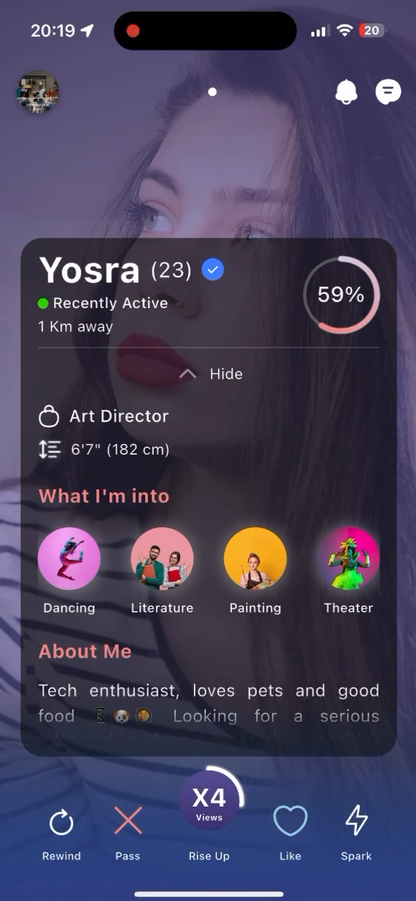
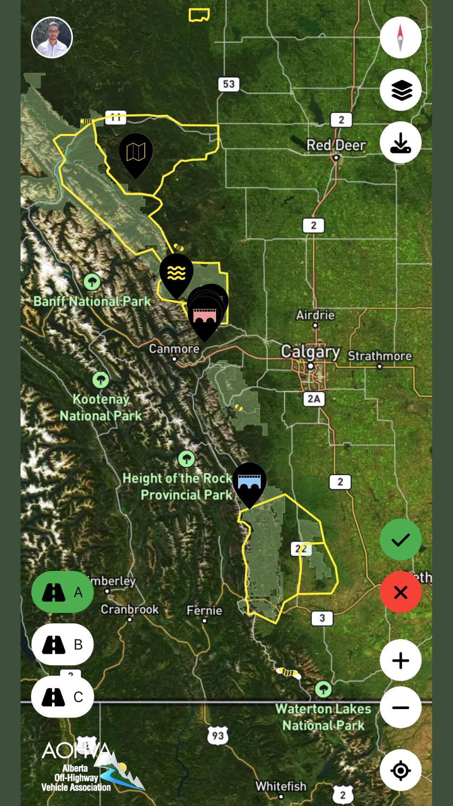

# 🚀 Oussama Galmami – Portfolio  
**Senior Flutter Engineer | DevOps & Mobile Automation Expert**  
🔹 7+ years in **Flutter, CI/CD, DevOps, and scalable architectures**  
🔹 Specialized in **offline-first apps, GIS, BLE, and high-performance mobile solutions**  
🔹 Built **20+ apps**, leading teams and delivering enterprise-grade solutions  

📍 **Currently:** Senior Flutter Engineer @ AKQA Leap  
📬 [Email](mailto:oussama.galmami@gmail.com) | 🔗 [LinkedIn](https://www.linkedin.com/in/oussama-galmami-769a20108/) | 🖥 [GitHub](https://github.com/ousamagl)  

---

## 🎯 **Featured Projects**  

### **1️⃣ Nestlé Goodnes App** *(Enterprise Health & Nutrition Platform)*  
📱 **Tech:** Flutter, Isar DB, BloC, Fastlane, Firebase, GitHub Actions  
🔗 **Links:** *(Private Project – Not Yet Published)*  
✅ **Built scalable feature-first architecture with DI (BloC pattern)**  
✅ **Developed offline-first data sync system using Isar DB**  
✅ **Automated CI/CD workflows** for app distribution & monitoring  

---

### **2️⃣ Bliq Driver & Passenger Apps** *(Mobility & Ride-Hailing, Berlin-based)*  
📱 **Tech:** Flutter, RXDart, Firestore, Google Maps, Adjust, Amplitude  
🔗 **Links:** [Bliq Google Play](https://play.google.com/store/apps/details?id=ai.bliq.passenger) | [Bliq App Store](https://apps.apple.com/us/app/bliq-compare-save-on-rides/id6448750981?mt=8) | [Bliq Driver Google Play](https://play.google.com/store/apps/details?id=ai.bliq.ride) | [Bliq Driver App Store](https://apps.apple.com/us/app/bliq-driver-earn-more-money/id1481068175?mt=8)

✅ **Implemented driver engagement & rewards using RXDart & Firestore**  
✅ **Integrated real-time analytics tracking (Adjust, CleverTap, Google Analytics)**  
✅ **Customized Google Maps components for ride-sorting & navigation**  

---

### 3️⃣ **Lovester** *(AI-Powered Dating & Matchmaking – Private Project)*
📱 **Tech:** Flutter, Riverpod, Firebase, Custom Animations
🔗 **Links:** (Private – [Request Access for Demo]())
🎥 **Demo Video:** 🔗 Watch Here (Private Link – [Request Access](https://drive.google.com/file/d/1TyIlsRDFzMESUA8WOEa-bif9-m5fCCmY/view?usp=sharing))

✅ **Designed system architecture using MERN stack, AWS, GCP & Terraform.**
✅ Developed mobile architecture **(MVVM, DI, Inversion of Control)** with **real-time data streaming via Socket.io & MongoDB micro-batch processing**.
✅ Led a team of 6 Flutter developers, implementing wireframes with **advanced animations & custom navigation transitions**.
✅ **Designed & executed unit/widget testing scenarios**, ensuring app stability.

---

### 4️⃣ **AOHVA Trail Toolbox** *(GIS-Based Trail Mapping)*
📱 **Tech:** Flutter, OpenStreetView, GraphQL, Spatial SQL
🔗 **Links:** [Google Play](https://play.google.com/store/apps/details?id=com.df.aohva) | [App Store](https://apps.apple.com/ca/app/aohva/id6472849992?platform=iphone)
🎥 **Demo Video:** 🔗 [Route recording feature](https://vimeo.com/1016849583) | [Maintenance route feature](https://vimeo.com/1016849660)

✅ Developed an **offline Flutter app** for off-highway maintenance & asset creation.
✅ Integrated **OpenStreetView for GIS-based trail mapping & navigation**.
✅ **Optimized data querying using GraphQL & Spatial SQL** for high-performance offline processing.

## 📌 **Other Notable Apps**  
| **App Name**  | **Industry**  | **Tech Stack**  | **Links**  |  
|--------------|-------------|---------------|-----------|  
| Ongohub (Campaign management) | Task Management, AI/ML | Flutter, Google Image Recognition, ML Toolkit, Image Processing | [Play Store](https://play.google.com/store/apps/details?id=com.df.ongo) |  
| Firenet (Wildfire Monitoring) | GIS, Emergency | Flutter, Kotlin, Socket.io | [Play Store](https://play.google.com/store/apps/details?id=com.df.aohva) |  
| Umay (BLE Cryo-Thermal Controller) | IoT, Medical | Flutter, Swift, Nordic-DFU - BLE | [Website](https://umay.rest/pages/discover-umay-rest) |  

---

## 🛠 **Tech Stack & Skills**  
🟢 **Languages:** Dart, Kotlin, Swift, C++, JavaScript  
🟢 **Frameworks:** Flutter, Xamarin, Nest.js, Angular  
🟢 **DevOps & CI/CD:** AWS, GCP, Firebase, Docker, Kubernetes, Fastlane  
🟢 **Architecture:** Clean Architecture, Microservices, Serverless  
🟢 **Testing & Automation:** Unit/Widget Testing, SonarQube, Mocktail  
🟢 **Specialties:** GIS, BLE, Payment Systems, Analytics  

---

## 📬 **Get in Touch**  
📩 [Email](mailto:oussama.galmami@gmail.com) | 🔗 [LinkedIn](https://www.linkedin.com/in/oussama-galmami) | 🖥 [GitHub](https://github.com/ousamagl)  
